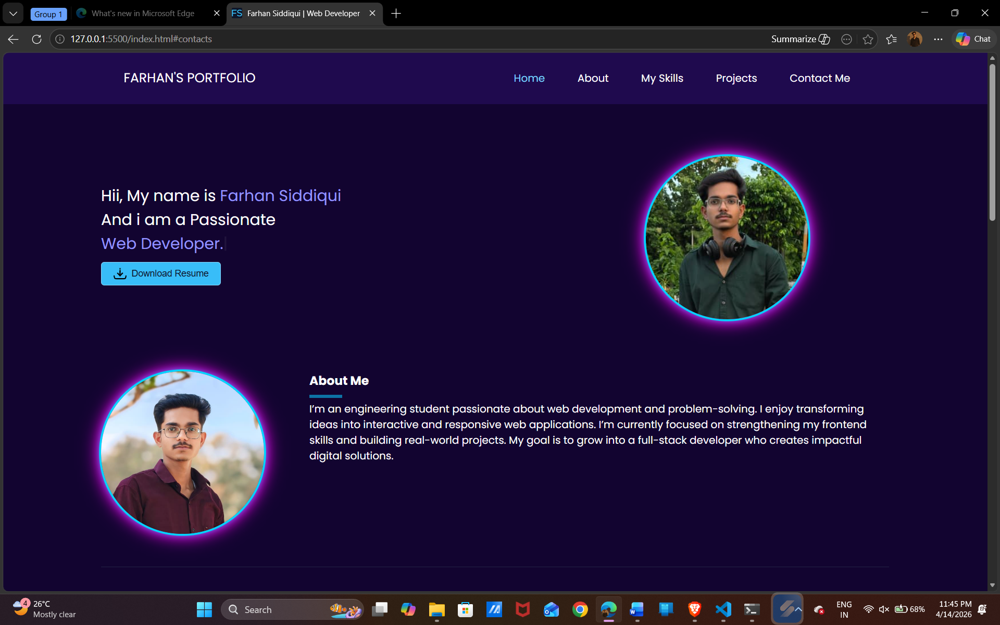
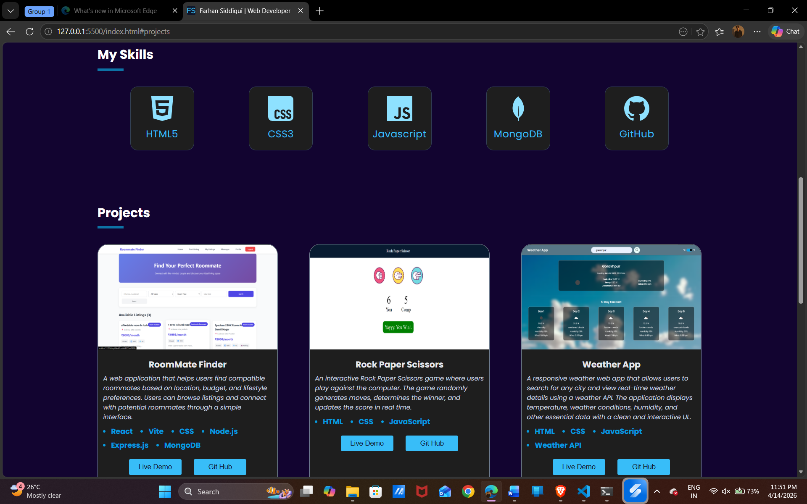

#  Portfolio Website


A modern **Portfolio Website** built using **HTML, CSS, and JavaScript**.

This portfolio showcases my **projects, skills, projects and contact details** with a clean UI, smooth animations, and fully responsive design.

The interface is designed with a **modern layout**, glowing effects, smooth scrolling, and mobile-friendly navigation.

---

#  Preview

<p align="center">


</p>

---

#  Features

* Fully Responsive (Mobile + Desktop)
* Smooth Scroll Animations
* Animated Hamburger Menu
* Glowing Profile Design
* Skills Section with Cards
* Projects Showcase
* Contact Section with Social Links
* Clean and Modern UI

---

#  Technologies Used

| Technology       | Purpose                     |
| ---------------- | --------------------------- |
| HTML5            | Structure of the website    |
| CSS3             | Styling, layout, animations |
| JavaScript (ES6) | Interactivity and logic     |

---

#  Project Structure
<pre>
Portfolio
│
├── assets
│    ├── currency.png
│    ├── game.png
│    ├── room.png
│    └── weather.png
├── images
│     ├── Image1.png
│     └── Image2.png
├── Screenshots
│    ├── preview1.png
│    └── preview2.png
├── index.html
├── arrow-icon.svg
├── favicon.ico
├── resume.pdf
├── style.css
└── script.js
</pre>

---

# ⚙️ How It Works

### Navigation

Smooth scrolling is implemented using:

<pre>
scroll-behavior: smooth;
</pre>

### Run Locally 

Follow these steps to run the project on your local machine. 

### 1. Clone the repository

```bash
git clone https://github.com/fsid908/Portfolio.git
```

### 2. Navigate into the project directory

```bash
cd Portfolio
```

### 3. Open the project

Simply open the `index.html` file in your browser.

You can also use **VS Code Live Server** for a better development experience.

---


## Contributing

Contributions are welcome.

If you'd like to improve the project:

1. Fork the repository
2. Create a new branch
3. Commit your changes
4. Submit a Pull Request

---

## Future Improvements

Possible upgrades:

<ul>
  <li>Dark / Light Mode</li>
  <li>More animations</li>
  <li>Blog section</li>
  <li>Backend integration</li>
</ul>

---

## Learning Outcomes

This project demonstrates:

<ul>
  <li>Responsive Web Design</li>
  <li>CSS Animations</li>
  <li>DOM Manipulation</li>
  <li>Scroll-based animations</li>
  <li>UI/UX Design</li>
</ul>

---

## Support

If you found this project helpful, consider giving it a **star ⭐ on GitHub**.

---

## License

This project is licensed under the **MIT License**.

---
## 👨 Author

**Farhan Siddiqui**

- GitHub: https://github.com/fsid908  
- LinkedIn: https://www.linkedin.com/in/farhan-siddiqui-dev  
- Email: fsid738@gmail.com  
